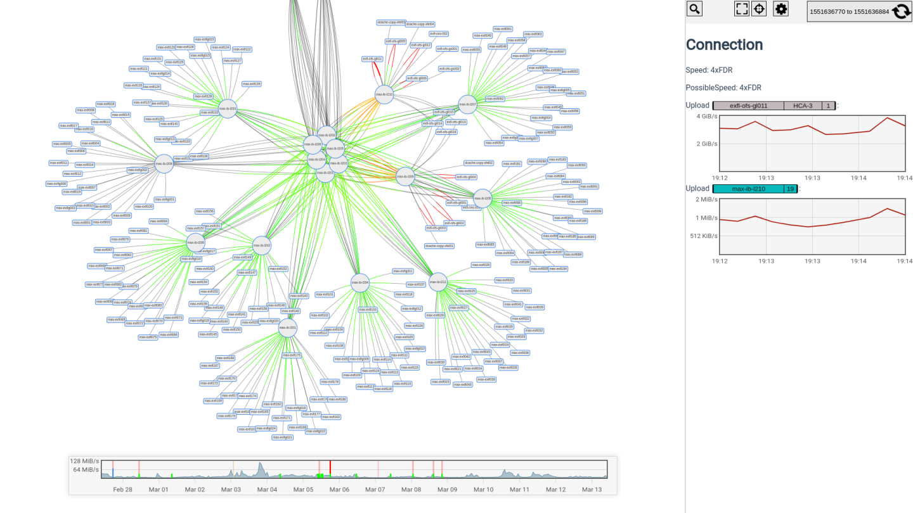

# InfiniBand Radar Client & API Server

If you have any questions please [open an issue](https://github.com/infiniband-radar/infiniband-radar-daemon/issues)

This repository contains the web interface and API server.

The API and WebClient **can be run on a server that is not connected to the InfiniBand**.

To run a complete setup you need to install the [daemon](https://github.com/infiniband-radar/infiniband-radar-daemon) on a server that is connected to a InfiniBand fabric.



## Requirements: 
 - A folder with SSL files called `cert.pem` and `key.pem`
 - docker >= 17.05 and [docker-compose](https://github.com/docker/compose/releases)
 - Ports 80 and 443 available

## Start a fresh installation:
1. Clone this repo
2. Copy the `*.template.json` to `*.json` from `./config` and edit them to your needs
3. Share the server keys with your daemon config
4. Run `GATEWAY_CERTS='<PATH_TO_CERT_AND_KEY>' docker-compose up -d`

## Quick start with self signed certificate 
```sh
mkdir ssl_certs
cd ssl_certs
openssl req -x509 -newkey rsa:4096 -subj '/CN=localhost' -keyout key.pem -out cert.pem -days 365 -nodes
cd ..
GATEWAY_CERTS="$PWD/ssl_certs" docker-compose up -d
```

The interface will then be available under https://127.0.0.1/

A pre-packaged Grafana instance will also be available under https://127.0.0.1/grafana

# Configuration

`/config/apiServer.json`

```json
{
    "server": { // API webserver configuration, if you are using docker-compose leave it as it is
        "host": "0.0.0.0",
        "port": 4201
    },
    "fabrics": [ // List of all fabrics
        {
            "fabricId": "fabric1",
            "name": "Fabric 1",
            "image": "<UrlToImageOrBase64Encoded>"
        },
        {
            "fabricId": "fabric2",
            "name": "Fabric 2",
            "image": "<UrlToImageOrBase64Encoded>",
            "hideFromInitialSelection": true // need to click to see it in fabric selection
        }
    ],
    "authentication": { // The token must match the token in the daemon config
        "server": {
          "testToken": "localhost",
          "<TOKEN>": "<DESCRIPTION>"
        },
        "user": { // Can be deleted if no user authentication is required.
            "userTokenExpirationTime": "20d",
            "userTokenSharedKey": "someKey",
            "identityProvider": {
                "type": "ldap",
                "url": "ldaps://<ldapServerUrl>:1234",
                "allowedUsersFileName": "../config/allowedUsers.json" // Can be deleted if all valid LDAP users should have accsess to the application
                "queryString": "uid=$username" // The LDAP query that is used in a bind, the $username will be repaced with the username
            }
        }
    },
    "influxDb": {
        "host": "influxdb",
        "database": "infiniband_radar"
    },
    "mongoDb": {
        "host": "mongodb://mongodb:27017/",
        "database": "infiniband_radar"
    }
}
```


# Folder structure
## Main code
- `client` - Web client code
- `common` - Code that is used by the server and the client
- `server` - API server code

## Other
- `config` - Contains the config template and _real config_
- `gateway` - NGINX reverse proxy to forward the requests to the right container
- `grafana` - [Grafana](https://grafana.com/) docker instance with pre configured dashboards

## Dynamic
- `data` - (Folder that is created by Docker) - Contains the Database
- `ssl_certs` - The certificates for the NGINX gateway server. Must be defined with the env `GATEWAY_CERTS` if you are using docker-compose

# Licence
GNU GENERAL PUBLIC LICENSE

Developed by the [Deutsches Elektronen-Synchrotron](https://www.desy.de/)
